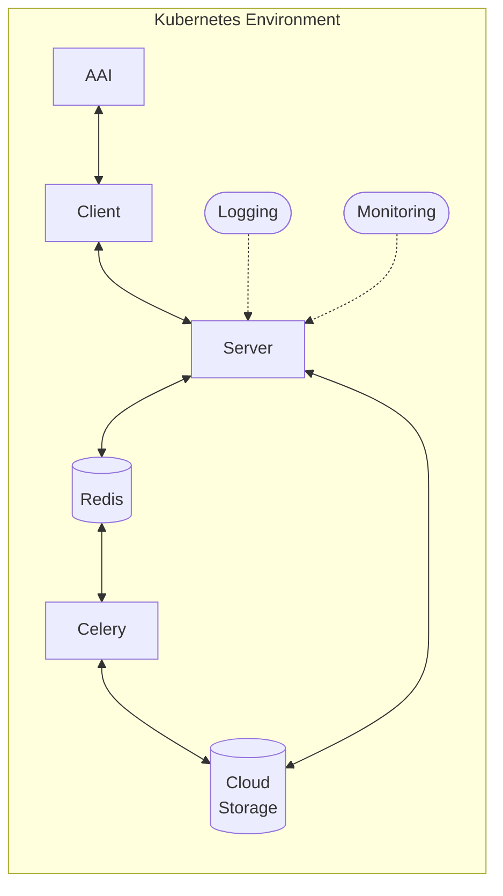

Overall architecture could be seen down below

```mermaid
flowchart LR;
	subgraph Kubernetes Environment
		direction TB

	    Client<-->Server
	    AAI<-->Client
	    Server<-->Redis[(Redis)]
	    Redis<-->Celery<-->CloudStorage[(Cloud<br/>Storage)]
	    Server<---->CloudStorage
	    Logging([Logging])-.->Server
	    Monitoring([Monitoring])-.->Server
	end  
```

Desrizione ad alto livello

Link a singoli componenti