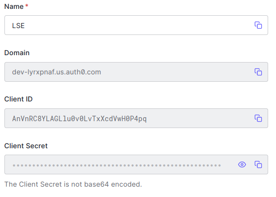

# Configure AAI
Provider accepted for Authentication and Authorization Infrastructure (AAI) are listed [here](https://next-auth.js.org/v3/configuration/)
Example free provider could be setted up using [auth0](https://auth0.com/).

## Setup provider
### Auth0
- Open [auth0](https://auth0.com/) in the browser
- Login
- Create application
	- Single page web application
	- Add ``http://lse.local/api/auth/callback/auth0`` in ``allowed callback url`` field
	- Remember the information showed in the app detail to next fulfill client configmap.yaml with correct credentials
    	- 
		- NEXTAUTH_AUTH0_DOMAIN=\<domain>
		- NEXTAUTH_AUTH0_CLIENT_SECRET=\<id>
		- NEXTAUTH_AUTH0_CLIENT_ID=\<secret>

