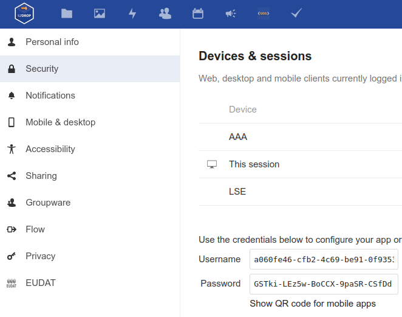

# NextCloud configuration
There are two option to configure Nextcloud storage.
You could deploy your [own](https://nextcloud.com/) or take advantage of already implemented one.

## Free cloud NextCloud service 
- Register to [B2Drop](https://marketplace.eosc-portal.eu/services/b2drop).
- Login
- Generate app password:
  - settings -> security -> create new app password
  - 
  - Remember those credentials in order to fulfill server configmap
- Upload some [example experiments](../lse-demo.zip) under demo-lse folder

Documents tree needs to be as follow:
```
demo-lse
└── demo-mnist-autoencoder (or experiment name)
   └── clusters
   └── images
   └── reductions
   └── embeddings.json
   └── label.json
   └── metadata.json
```