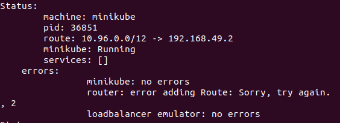

Install [minikube](https://minikube.sigs.k8s.io/docs/) (LSE was tested using version v1.22.0)

Perform following steps:
- minikube start
- minikube addons enable ingress
- minikube tunnel
  

Map minikube tunneling ip address to http://lse.local
```text
e.g. if minikube tunnel on 192.168.49.2, you've to add to etc/hosts file the line:
    192.168.49.2 lse.local
```

