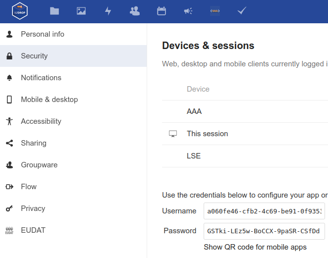

# Server configuration
## Requirements
- Configured [Nextcloud](config_Nextcloud.md)
## Steps
- Open [configmap.yaml.template](../k8s/local/server/configmap.yaml.template)
- Fill empty fields
    - NEXCLOUD_HOST
      - If b2drop: https://b2drop.eudat.eu/
    - NEXCLOUD_USER
    - NEXCLOUD_PASSWORD
    - Taken from: 
- Duplicate file configmap.yaml.template and rename it configmap.yaml